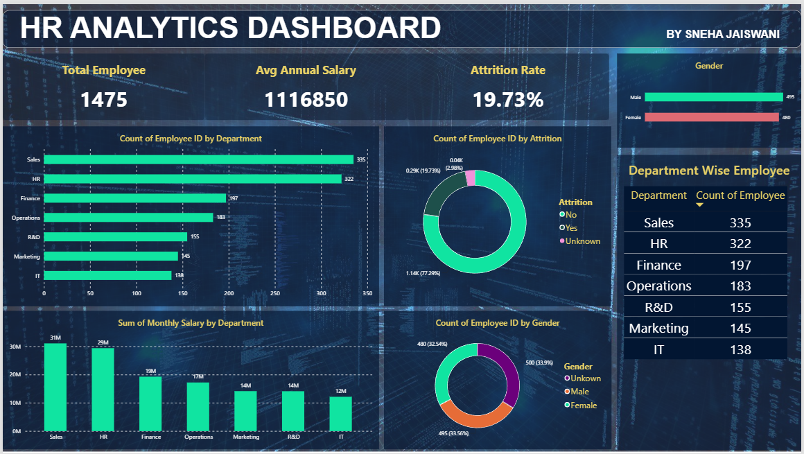

# instadot-internship-snehajaiswani_day5
# HR Analytics Dashboard

## Project Overview

This project presents an HR Analytics Dashboard developed using Power BI to analyze employee data and visualize key workforce metrics. The dashboard was created after cleaning and preparing the dataset to ensure consistent and accurate reporting.

## Data Preparation

The dataset was cleaned by handling missing values, standardizing department names, and correcting inconsistent records. This helped improve the quality of the analysis and ensured that all visualizations reflected accurate information.

## KPIs

* Total Employees
* Average Annual Salary
* Attrition Rate

## Dashboard Features

The dashboard includes:

* Department-wise Employee Distribution
* Salary Analysis by Department
* Employee Attrition Distribution
* Gender Distribution
* Gender-wise Employee Count
* Department-wise Employee Table

## Project Summary

The dashboard provides a clear overview of the organization's workforce and highlights important HR metrics in an easy-to-understand format. It enables quick analysis of employee distribution, salary patterns, and attrition trends while supporting data-driven decision-making through interactive visualizations.

## Dashboard Screenshot

[Paste or insert your Power BI dashboard image here.]

